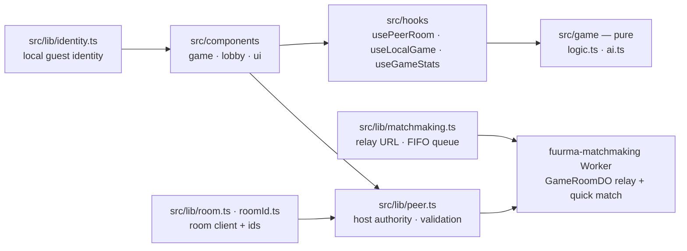

# tic-tac-toe — Architecture

Guest-first online tic-tac-toe: React 19 (Vite 8) SPA deployed to
Cloudflare Pages (`wrangler pages deploy dist`). The game core is pure and
self-play-tested (`src/game`: rules, AI with behavior/selfplay/bench
suites); identity is generated locally so play never requires an account.
Online rooms go through the shared `fuurma-matchmaking` Worker (quick-match
pairing + `GameRoomDO` WebSocket relay); host-authoritative validation runs
client-side in `src/lib/peer.ts`.

## Modules

- src/game — pure engine: logic.ts rules, ai.ts (easy random / normal d4 / hard d8 alpha-beta; behavior + selfplay + bench suites), constants
- src/hooks — usePeerRoom (online), useLocalGame, useGameStats
- src/lib/peer.ts — peer-room transport with host-authoritative move validation (hostile-input test suite)
- src/lib/matchmaking.ts — relay URL acquisition, FIFO queue position reporting
- src/lib/room.ts + roomId.ts — room client wrapper and room id helpers
- src/lib/identity.ts — generated guest identity, localStorage-backed
- src/components — game board and lobby surfaces
- e2e/ — Playwright smoke tests
- deploy — `wrangler pages deploy dist` (Cloudflare Pages)
- fuurma-matchmaking (separate Worker) — pairing + GameRoomDO relay; not in this repo
