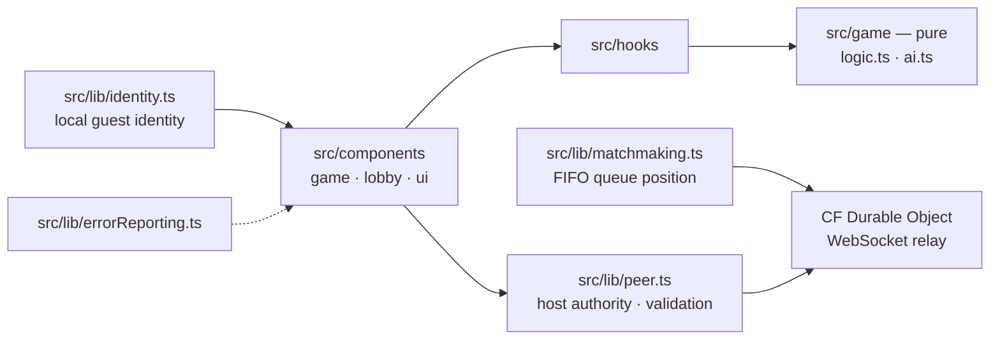

# tic-tac-toe — Architecture

Guest-first hybrid-card tic-tac-toe web game: React 19 (Vite) SPA deployed
to Cloudflare Pages. The game core is pure and self-play-tested
(`src/game`: engine, AI with behavior/selfplay/bench suites); identity is
generated locally so play never requires an account. Online rooms go through
a matchmaking service that hands back a Durable-Object WebSocket relay URL;
host-authoritative validation runs client-side in `src/lib/peer.ts`.

## Modules

- src/game — pure engine: logic.ts rules, ai.ts (behavior + selfplay + bench test suites), constants
- src/lib/peer.ts — peer-room transport with host-authoritative move validation (hostile-input test suite)
- src/lib/matchmaking.ts — relay URL acquisition, FIFO queue position reporting
- src/lib/identity.ts — generated guest identity, localStorage-backed
- src/lib/errorReporting.ts — client error reporting
- src/components — game board and lobby surfaces
- deploy — `wrangler pages deploy dist` (Cloudflare Pages)
